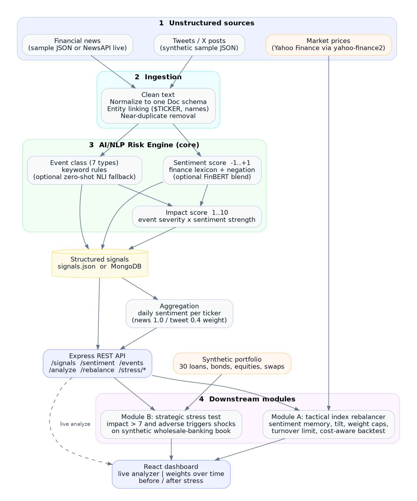

# AI/NLP Risk Engine: Sentiment-Driven Index Rebalancing and Portfolio Stress Testing - S&P Global & Crisil Campus Hackathon

**Candidate Name:** Durgesh Bhatt
**College Email ID:** b423022@iiit-bh.ac.in
**College / Campus:** IIIT Bhubaneswar
**Demo Video Link:** [YouTube unlisted link]
**Slide Deck Link (if hosted externally):** Not external, see [`docs/presentation.pdf`](docs/presentation.pdf)

## 1. Project Overview / Problem Statement & Approach

Financial risk signals are buried in unstructured text such as news articles and social posts, and they arrive faster than analysts can read them. The case study asks for a unified **AI/NLP Risk Engine** that ingests text from at least two sources and turns it into structured, machine-readable signals (sentiment score, event class, impact score), plus at least one downstream module that proves the signals are useful.

This prototype implements the core engine and **both** downstream modules:

- **Core engine.** News and tweets are cleaned, normalized to one schema, linked to tickers, and de-duplicated. Each document then receives a sentiment score (-1 to +1), an event class (Geopolitical, Macroeconomic, Credit Event, Merger/Acquisition, Product Launch, Earnings, Regulatory), and an impact score (1 to 10). Every signal carries the matched terms as evidence, so a score can always be explained.
- **Module A, tactical index rebalancer.** A mock 15-stock S&P 100 index starts equal-weighted. Daily sentiment (credibility-weighted, decayed over time) tilts weights up or down under weight caps and a turnover limit. The dashboard shows weights over time, a sentiment heatmap that explains each move, and a cost-aware backtest against Yahoo Finance prices.
- **Module B, strategic stress tester.** When the engine reports an adverse event with impact above 7, shocks scaled by the impact score (equity, rates, credit spreads) are applied to a synthetic 30-position wholesale-banking book. The dashboard shows portfolio value before and after, impact by asset class, and position-level losses. A what-if tool lets you simulate any event type and severity.

## 2. Architecture & Tech Stack



| Layer | Choice |
|---|---|
| Language | TypeScript end to end (Node 20+) |
| Engine | Lexicon sentiment with negation, keyword event classifier, severity-based impact. Optional FinBERT (`Xenova/finbert`) blend and zero-shot NLI fallback via `@huggingface/transformers` |
| API | Express 5, Zod validation |
| Storage | JSON files by default (zero setup), optional MongoDB (`docker-compose.yml`) |
| Market data | `yahoo-finance2` (public data, no API key) |
| Dashboard | React 19, Vite, Recharts |
| Tests | Node test runner with `tsx` (41 server tests: engine, API, rebalancer, stress model) |

Data flow: sources, ingestion, NLP engine, structured signals, daily aggregation, REST API, Module A and Module B, dashboard. Signals are plain JSON, so any other consumer can subscribe through the API or read the file.

## 3. Dataset Used

All data lives in [`data/`](data/) and is either synthetic or public. No S&P Global, Crisil, or other confidential data is used.

| File | Nature |
|---|---|
| `news_sample.json`, `tweets_sample.json` | **Synthetic** headlines and tweets for 15 S&P 100 stocks plus market-wide macro and geopolitical events. Generated from templates by `src/server/scripts/generateSyntheticData.ts` (seeded, reproducible). Includes ground-truth labels (`gold_*`) used only to evaluate the engine. |
| `eval_realistic.json` | 34 hand-written headlines and tweets with different phrasing from the generator, used as a held-out style check. |
| `portfolio.json`, `shocks.json` | **Synthetic** wholesale-banking book (8 loans, 8 corporate bonds, 4 government bonds, 6 equities, 4 swaps and caps) and the event-type shock table. |
| `prices.csv` | Daily closes from **Yahoo Finance** (`npm run fetch:prices`). |
| `prices_fallback.csv` | Synthetic random-walk prices, used only if Yahoo is unreachable. |

Assumptions:

- News is more credible than a tweet (weights 1.0 and 0.4, viral tweets slightly higher).
- Shock sizes in `shocks.json` are illustrative, not calibrated to history.
- The Kaggle and GDELT datasets suggested in the case study were not used. Synthetic text was chosen so every label is known and results are reproducible offline. NewsAPI ingestion is implemented as an optional live source.

## 4. Quickstart & Installation

Runtime: **Node 20+** (developed on Windows with Git Bash, tests also run on Linux with Node 22). Dependencies are declared in `src/server/package.json` and `src/client/package.json`.

```bash
git clone https://github.com/durgesh-5699/iiit-bhubaneswar-durgesh-hackathon.git
cd iiit-bhubaneswar-durgesh-hackathon

# 1) API + engine
cd src/server
npm install
cp .env.example .env            # optional settings
npm run fetch:prices            # optional: real Yahoo prices (falls back to synthetic if offline)
npm run build:signals           # ingest -> NLP engine -> aggregate  (writes data/processed/)
npm run dev                     # API on http://localhost:4000

# 2) Dashboard (second terminal)
cd src/client
npm install
npm run dev                     # http://localhost:5173
```

Useful commands (run in `src/server`):

| Command | What it does |
|---|---|
| `npm test` | 41 tests |
| `npm run nlp` | Evaluates the engine against ground truth and writes `data/processed/nlp_report.json` |
| `npm run module-a` | Backtest summary for the rebalancer |
| `npm run module-b` | Stress-test summary for every triggering event |
| `npm run nlp:models` | Same as `nlp` plus FinBERT and zero-shot models (first run downloads them) |
| `npm run ingest -- --live` | Adds live NewsAPI articles (needs `NEWSAPI_KEY` in `.env`) |
| `npm run seed:mongo` | Loads signals into MongoDB (needs `MONGODB_URI`) |

API quick tour:

```bash
curl -X POST localhost:4000/api/analyze -H "content-type: application/json" \
  -d '{"text":"Fed signals more rate hikes as inflation stays stubbornly high"}'
curl "localhost:4000/api/events?min_impact=8"
curl "localhost:4000/api/rebalance?tilt=1.2&max_turnover=0.05"
curl "localhost:4000/api/stress/scenario?event_type=Geopolitical&impact=9"
```

| Endpoint | Purpose |
|---|---|
| `POST /api/analyze` | Score any text in real time |
| `GET /api/signals`, `/api/signals/:id` | Filterable structured signals |
| `GET /api/sentiment/latest`, `/api/sentiment/:ticker` | Daily sentiment series (Module A feed) |
| `GET /api/events` | High-impact events (Module B feed) |
| `GET /api/rebalance` | Run the rebalancer with tunable parameters |
| `GET /api/stress/triggers`, `/run`, `/scenario`, `/portfolio` | Stress-test detected events or what-if scenarios |

## 5. Key Results & Domain Impact

Reproduce the numbers below with `npm run nlp`, `npm run module-a`, and the dashboard.

**NLP engine (rules-only mode, ground truth known).**

| Test set | Sentiment label accuracy | Event accuracy | Impact score |
|---|---|---|---|
| Synthetic sample (210 docs after de-duplication) | 99% (MAE 0.17) | 89% (majority-class baseline 18.6%) | MAE 0.6, 92% within 1 point |
| Hand-written set (34 items) | 97% | 100% | n/a |

The synthetic set is generated from templates, so its numbers show the pipeline works but overstate real-world accuracy. The 34-item set was also used while tuning the lexicon, so it is a development set, not an independent test. Measuring on real labelled financial news is the first next step.

**Module A.** Positive sentiment raises a stock's weight and negative lowers it; weights are always within 2% to 15% and turnover stays under 10% per day. With real Yahoo prices and tilt 1.5, the strategy returned -0.62% against -0.18% for the equal-weight benchmark, with an information coefficient of -0.06 over 300 stock-days. That is the expected result: the news is synthetic and unrelated to real price moves, so the backtest validates the machinery (no look-ahead, cost and turnover control), not alpha.

**Module B.** 29 of the 36 high-impact signals are adverse and trigger a stress test. A market-wide Geopolitical event with impact 9 moves the $1,644.5m book to $1,558.8m (-5.21%). Equities, corporate bonds, and loans lose, government bonds gain from lower rates, and pay-fixed swaps behave as the model predicts. Company-specific events hit the issuer fully and its sector partially (30% spillover).

**Why it matters.**

- *Speed:* an analyst can read dozens of headlines a day; the engine scores thousands and surfaces only what crosses a severity threshold.
- *Traceability:* each signal lists the terms that drove it, which supports model-risk review.
- *Actionability:* the same signal drives a tactical decision (rebalancing) and a strategic one (stress testing), which is the "unified engine" idea in the case study.

**Limitations and next steps.** Lexicon and keyword rules are brittle on sarcasm and novel wording (FinBERT and zero-shot are wired in as an optional upgrade); the engine is batch plus on-demand rather than a streaming service; the backtest covers about one month; the stress model uses duration, beta, and DV01 approximations without convexity, netting, or collateral; shock sizes are not calibrated. Next steps: evaluate on real labelled news, add a streaming consumer, calibrate shocks to historical episodes, and add correlation-aware multi-event scenarios.

## Repository layout

```
.
├── README.md  LICENSE  docker-compose.yml
├── data/                 synthetic and public datasets, shock table, eval set
├── docs/                 architecture.png, presentation.pdf
└── src/
    ├── server/           Express API and engine (TypeScript)
    │   ├── scripts/      data generation, price fetch, CLI runners
    │   └── src/          ingestion, nlp, aggregation, store, api, modules/{rebalancer,stress}
    └── client/           React dashboard
```

## AI assistance

AI tools (Claude) were used to help write and review code and documentation. The design decisions, parameters, and results in this repository were reviewed and run by the author.
